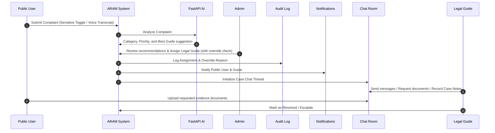

# Public User to Legal Guide Flow Report

This report outlines the end-to-end user-triage-mediation lifecycle in ARAM, detailing how public users receive support from legal guides.

## Lifecycle Workflow

### 1. Complaint Submission
- **Sender:** Public User (Citizen role).
- **Metadata Captured:** Title, description, language, district, sensitive tag toggle, preferred helper gender (female/any), identity visibility (VISIBLE / PARTIAL / HIDDEN), and document uploads.

### 2. AI Recommendation Triage
- **Processing:** Done asynchronously during submission.
- **AI Recommendation Engine Output:**
  - Categorization and triage priority score.
  - Recommended authority (e.g. Labour Dept).
  - Recommended Legal Guides matching language, category specialty, workload capacity, gender matching preference, and women-sensitive capability.

### 3. Administrative Assignment
- **Action:** Admin views the AI suggestions list on the complaint recommendations tab.
- **Controls & Auditing:**
  - If a case is women-sensitive (domestic violence, harassment, etc.), ARAM requires a FEMALE, women-support-trained legal guide.
  - If the Admin overrides this preference to assign another available guide, ARAM enforces an **Admin Override Reason** input which is audited in database logs.

### 4. Secure Chat Room Initiation
- **Creation:** Triggers automatically upon guide assignment.
- **Scope:** Initializes a private `CaseChatThread`. Both parties are notified in-app.
- **Privacy Shield:** Email addresses and mobile numbers are completely hidden. Direct communication occurs exclusively via the in-app chat console.

### 5. Legal Guide Resolution & Problem-Solving
- **Triage Console Actions:**
  - Secure chat message exchange.
  - **Request Documents:** Triggers state change to `DOCUMENTS_PENDING` and prompts user with requested document name.
  - **Case Notes:** Allows private, admin-visible, or user-visible text records.
  - **Escalate:** Lets the guide escalate the case to the System Admin with a mandatory reason.
  - **Status Transitions:** Maps case states from `HELPER_ASSIGNED` to `IN_PROGRESS`, `DOCUMENTS_PENDING`, `RESOLVED`, and `CLOSED`.

---

## Technical Flow Diagram

