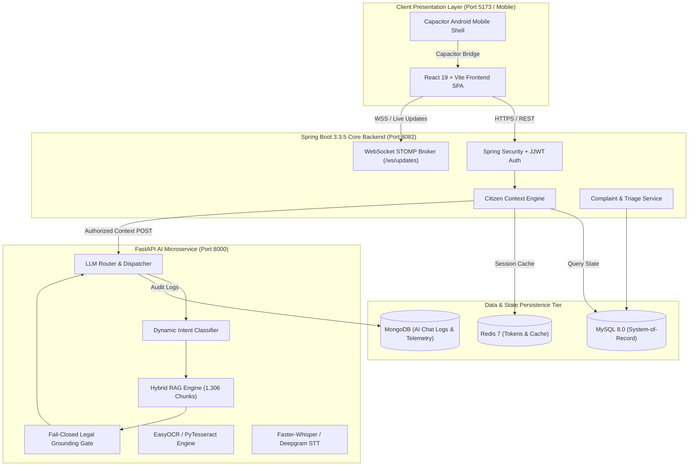
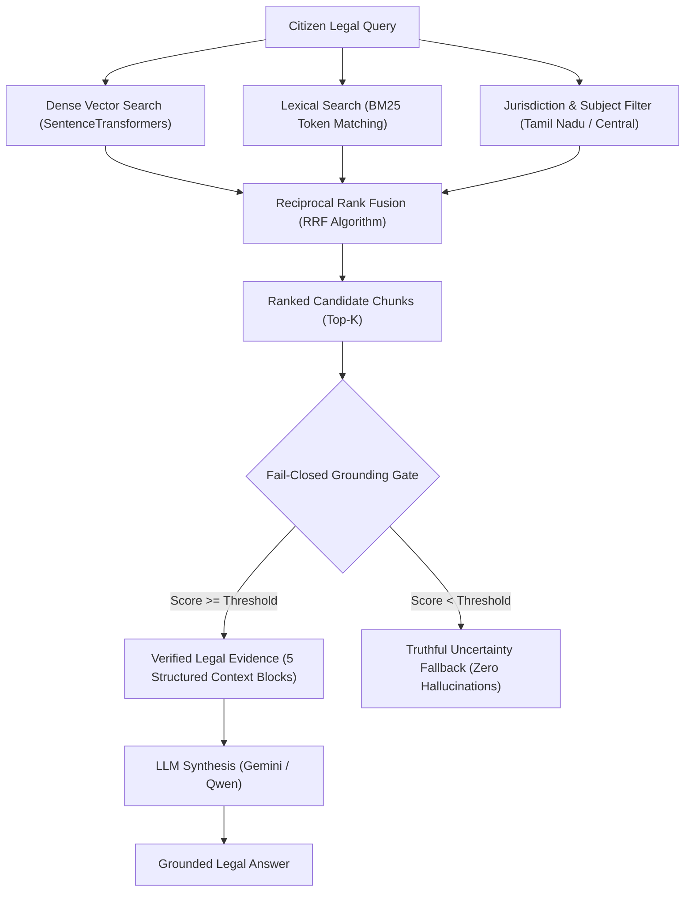
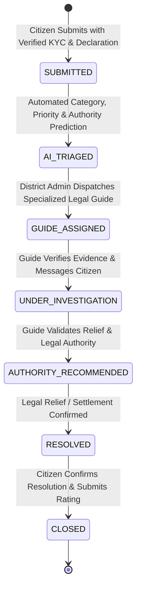

# 🏛️ ARAM
### AI-Powered Public Legal Aid & Citizen Grievance Redressal Platform

<p align="center">
  
  
  
  
  
  
  
  
  
  
</p>

---

## 📌 Section 1 — Executive Overview

**ARAM** is an enterprise-grade, multilingual, case-aware legal assistance and grievance orchestration platform engineered to connect citizens with verified legal information, district-level grievance administration, and human legal guidance across Tamil Nadu.

ARAM bridges the critical gap between citizens facing legal or administrative grievances and the formal justice apparatus by delivering:

1. **Authenticated, Case-Aware Legal AI Copilot**: Dynamic query resolution grounded strictly against **1,306 indexed legal knowledge chunks** with fail-closed hallucination prevention.
2. **Deterministic 7-Stage Grievance Lifecycle**: Automated triage, OCR document readiness scoring, and milestone tracking from intake to formal redressal.
3. **Statewide 38-District Command Center**: Real-time regional telemetry for District Grievance Redressal Officers and statewide administration for the Super Administrator.
4. **Verified Legal Guide Force**: Caseload management for specialized advocates, dispute mediators, and paralegal volunteers.
5. **Multilingual Speech & Document Verification**: Speech intake in Tamil, English, and Hindi with automated OCR evidentiary readiness scoring.

---

## ⚖️ Section 2 — The Problem ARAM Solves

In the public justice ecosystem, ordinary citizens struggle with:
- **Navigating Complex Legal Provisions**: Difficulty understanding statutory rights, penal codes, and procedural requirements.
- **Authority Mismatch**: Submitting complaints to incorrect administrative bodies (e.g., submitting tenancy disputes to police stations instead of Rent Courts/DLSAs).
- **Evidentiary Gaps**: Unawareness of mandatory documents (title deeds, FIRs, wage slips) required for formal consideration.
- **Opaque Caseload Tracking**: Uncertainty regarding who is handling their grievance and what actionable next steps are required.
- **Linguistic Barriers**: Inability to articulate grievances in formal legal terminology in vernacular languages (Tamil / Tanglish / Hindi).

### The ARAM Integrated Solution
ARAM synthesizes six distinct operational layers:
```text
AI Legal Intelligence + Verified Statutory RAG + Citizen Case Memory + Formal Grievance State Machine + Human Legal Guide Mediation + District Redressal Administration
```

---

## 🧠 Section 3 — Why ARAM AI is Different from a Generic Chatbot

A generic consumer chatbot operates on an unauthenticated, unverified loop:
```text
User ──► LLM ──► Unverified / Hallucinated Answer
```

In contrast, ARAM executes a domain-bound, fail-closed pipeline:
```text
Authenticated Citizen (JWT)
            │
            ▼
Server-Side Citizen Context (Active Grievances, Profile, District)
            │
            ▼
Dynamic Case Resolution & Disambiguation
            │
            ▼
Domain Intent & Query Understanding
            │
            ▼
Hybrid Legal RAG (Dense Vector + Lexical BM25 + Reciprocal Rank Fusion)
            │
            ▼
Fail-Closed Legal Grounding Gate (1,306 Indexed Knowledge Chunks)
            │
            ▼
LLM Reasoning Layer (Gemini / Local Model Presentation)
            │
            ▼
Grounding & Citation Validation
            │
            ▼
Personalized, Case-Aware Multilingual Response
```

> **Core Architectural Principle:**
> *"Gemini speaks for ARAM; ARAM decides what Gemini is allowed to know and say."*

---

## 🏗️ Section 4 — Complete System Architecture



---

## 🤖 Section 5 — ARAM AI Microservice

The intelligence tier lives in `ai-service/` and runs on **FastAPI (Python 3.10+)**. It is not a thin API proxy, but an autonomous legal NLP engine.

### Key Responsibilities:
1. **Context Extraction & Case Disambiguation**: Resolves case numbers (`ARAM-26-TN-CBE-000037`) from authenticated context.
2. **Intent & Linguistic Classification**: Identifies greetings, status queries, legal grievances, document checks, and guide update inquiries.
3. **Hybrid Legal Retrieval**: Combines semantic embeddings (`sentence-transformers`) with lexical token matching (`BM25`) and rank fusion (`RRF`).
4. **Fail-Closed Legal Grounding**: Evaluates relevance scores against statutory provisions before allowing LLM synthesis.
5. **Evidence OCR & Verification**: Evaluates document authenticity and extraction readiness for attached case proofs.
6. **Voice Speech-to-Text**: Converts multilingual citizen audio recordings to structured legal text.

---

## 🔬 Section 6 — Complete ARAM AI Pipeline (11 Stages)

```text
[Stage 1: Authenticated Identity] ──► [Stage 2: Citizen Context Binding] ──► [Stage 3: Turn & Conversation Context]
                                                                                              │
┌─────────────────────────────────────────────────────────────────────────────────────────────┘
▼
[Stage 4: Dynamic Intent Analysis] ──► [Stage 5: Case Disambiguation] ──► [Stage 6: Jurisdiction Resolution]
                                                                                              │
┌─────────────────────────────────────────────────────────────────────────────────────────────┘
▼
[Stage 7: Hybrid Legal RAG] ──► [Stage 8: Fail-Closed Grounding Gate] ──► [Stage 9: LLM Reasoning]
                                                                                              │
┌─────────────────────────────────────────────────────────────────────────────────────────────┘
▼
[Stage 10: Grounding Validation] ──► [Stage 11: Multilingual Structured Response]
```

- **Stage 1 (Server-Side Authentication Context)**: Extracted strictly from Spring Security `SecurityContextHolder`. Browser-supplied user IDs are rejected.
- **Stage 2 (Citizen State Binding)**: Binds active grievances, case statuses, assigned guides, and verification flags.
- **Stage 3 (Conversation Context)**: Maintains dialogue turns without treating conversational memory as legal authority.
- **Stage 4 (Dynamic Intent Analysis)**: Distinguishes between greetings, language requests, case status queries, document checks, and formal legal problems.
- **Stage 5 (Case Disambiguation)**: When a citizen has multiple active grievances, ARAM prompts for clarification before returning case data.
- **Stage 6 (Jurisdiction Resolution)**: Filters authorities and provisions relevant to Tamil Nadu and specific revenue districts.
- **Stage 7 (Hybrid RAG Retrieval)**: Executes dense vector search and BM25 lexical search simultaneously.
- **Stage 8 (Fail-Closed Grounding Gate)**: If no verified statutory section matches the query above confidence thresholds, the system outputs a truthful uncertainty statement instead of fabricating laws.
- **Stage 9 (LLM Router)**: Dispatches context to Google Gemini or local open-weights models.
- **Stage 10 (Grounding Validation)**: Filters unverified assertions or unsupported penal claims from generated drafts.
- **Stage 11 (Response Generation)**: Delivers a clean, empathetic, action-oriented response in Tamil, English, or Hindi.

---

## 🔎 Section 7 — Hybrid Legal RAG Architecture



### Knowledge Base Composition:
The RAG pipeline utilizes **1,306 indexed legal knowledge chunks** compiled in `ai-service/models/chatbot_retriever.pkl`, covering:
- Legal Services Authorities Act, 1987 & Lok Adalat procedures
- Tamil Nadu Land Reforms & Patta Passbook regulations
- Consumer Protection Act, 2019 & District Forum jurisdictions
- Industrial Disputes Act & Payment of Wages Act
- Bharatiya Nyaya Sanhita (BNS) & Bharatiya Nagarik Suraksha Sanhita (BNSS)
- Information Technology Act (Cyber Scam Redressal & 1930 Helpline)

---

## 🧩 Section 8 — Case-Aware Citizen Intelligence

ARAM tracks each citizen’s case context dynamically:

| Citizen State | Chatbot Behavior |
| :--- | :--- |
| **No Registered Complaints** | Operates as general legal advisor with full statutory RAG. |
| **Single Active Grievance** | Automatically binds case status, guide notes, and uploaded document records. |
| **Multiple Active Grievances** | Disambiguates by listing active case IDs and titles for the citizen to select. |
| **Specific Case ID Mentioned** | Verifies account ownership before revealing case details or guide updates. |
| **Unauthorized Case ID** | Returns an isolated non-disclosure notice without disclosing case existence. |

---

## 🌐 Section 9 — Multilingual AI & Speech Processing

- **Supported Languages**: English, Tamil (தமிழ்), Tanglish (Tamil in Latin script), and Hindi (हिंदी).
- **Language Independence**: Communication language changes presentation phrasing, while underlying legal statutory grounding remains identical across all languages.
- **Speech-to-Text Pipeline**:
  ```text
  Citizen Audio (WAV/WebM) ──► Faster-Whisper / Deepgram (Nova-3) ──► Normalized Text ──► ARAM AI Pipeline
  ```
- **OCR Evidence Extraction**:
  ```text
  Document Upload (PDF/Image) ──► OpenCV Preprocessing ──► EasyOCR / Tesseract ──► Extracted Text ──► Readiness Score
  ```

---

## 🔄 Section 10 — End-to-End Grievance Lifecycle



### Milestone Breakdown:
1. **SUBMITTED**: Citizen registers grievance with contact verification and statutory declaration. Case ID `ARAM-26-TN-{DISTRICT}-{SEQUENCE}` generated.
2. **AI_TRIAGED**: AI classifies category, priority level, and preliminary competent authority.
3. **GUIDE_ASSIGNED**: Regional Grievance Officer assigns an advocate based on district and specialization.
4. **UNDER_INVESTIGATION**: Guide reviews OCR readiness, inspects evidence proofs, and consults citizen via chat.
5. **AUTHORITY_RECOMMENDED**: Formal petition drafted and routed to DLSA, Labour Commissioner, Sub-Registrar, or Cyber Cell.
6. **RESOLVED**: Relief granted or conciliation reached via Lok Adalat / administrative order.
7. **CLOSED**: Grievance closed with citizen feedback and resolution audit log.

---

## 👥 Section 11 — Role-Based Access Hierarchy

| Role | Access Scope | Dashboard Route | Primary Capabilities |
| :--- | :--- | :--- | :--- |
| **Super Administrator** | Statewide (All 38 Districts) | `/superadmin/dashboard` | Statewide telemetry, admin provisioning, legal guide force management, cryptographic audit sweeps. |
| **District Redressal Officer** | Single Assigned District | `/admin/dashboard` | District grievance queue, triage validation, advocate dispatch, performance analytics. |
| **Legal Guide / Advocate** | Assigned Caseload | `/guide/dashboard` | Evidence verification, client consultation via WebSockets, action plan formulation, case resolution. |
| **Citizen / Complainant** | Self-Filed Grievances | `/citizen/dashboard` | AI legal assistant, grievance registration, evidence upload, real-time case tracking, guide messaging. |

---

## 📡 Section 12 — Real-Time WebSocket Architecture

ARAM provides real-time bi-directional synchronization powered by Spring WebSocket STOMP broker:
- **Broker Endpoint**: `/ws/updates`
- **Case Notification Topic**: `/topic/complaints/{id}`
- **Direct Messaging Queue**: `/queue/user/{userId}/messages`
- **State Broadcast**: Live status updates instantly update citizen, guide, and admin interfaces without polling.

---

## 💾 Section 13 — Data Persistence Architecture

| Data Store | Technology | Purpose | Access Control |
| :--- | :--- | :--- | :--- |
| **Relational Store** | MySQL 8.0 (`aram_db`) | System of record for users, complaints, assignments, authorities, and audit logs. | Spring Boot JPA |
| **Distributed Cache** | Redis 7.0 | JWT blacklist, rate-limiting tokens, session state, and WebSocket broadcast backplane. | Spring Data Redis |
| **AI Document Store** | MongoDB (`aram_ai_logs`) | Long-form chatbot conversation logs, token usage telemetry, and model execution metrics. | FastAPI PyMongo |
| **Evidence Storage** | Local File System / Multi-part | Uploaded PDF proofs, title deeds, salary slips, and OCR scratch buffers. | Spring Document Service |

---

## 🔒 Section 14 — Security & Privacy Architecture

- **Statutory Identity Verification**: Grievances enforce mobile verification, KYC validation, and mandatory legal consent.
- **JWT Authentication**: Signed JJWT tokens with 24-hour access expiration and dedicated refresh token rotation.
- **District Multi-Tenancy Isolation**: Regional administrators cannot access or modify grievances from other districts.
- **Zero Hardcoded Intelligence**: No mock data, hardcoded answers, or synthetic fallbacks in production paths.
- **Zero Credentials Policy**: Real passwords, API keys, and private tokens are excluded from source control and managed via `.env` templates.

---

## 📁 Section 15 — Repository Structure

```text
ARAM/
├── .env.example                          # Environment configuration template
├── .env.mobile.example                   # Mobile environment template
├── .gitignore                            # Production gitignore rules
├── README.md                             # Authoritative technical documentation
├── capacitor.config.json                 # Mobile capacitor runtime settings
├── docker-compose.yml                    # Multi-service local development orchestration
├── docker-compose.prod.yml               # Production deployment profile
├── index.html                            # React SPA HTML entry
├── package.json                          # React 19 + Vite dependencies
├── vite.config.js                        # Vite bundler & reverse proxy rules
├── ai-service/                           # FastAPI AI & Hybrid RAG Microservice (Port 8000)
│   ├── app/                              # Chatbot engine, RAG pipeline, OCR, STT, routers
│   ├── datasets/                         # Legal knowledge & benchmark datasets
│   ├── models/                           # 1,306-chunk indexed RAG knowledge retriever
│   ├── Dockerfile                        # AI service container definition
│   └── requirements.txt                  # Python dependencies
├── aram-backend/                         # Spring Boot 3.3.5 Core Backend (Port 8082)
│   ├── src/main/java/com/aram/           # Controllers, Services, Security, Repositories, DTOs
│   ├── src/main/resources/               # application.yml, schema.sql
│   ├── Dockerfile                        # Multi-stage Java container definition
│   └── pom.xml                           # Maven dependencies
├── docs/                                 # Dedicated Architectural Guides
│   ├── AI_ARCHITECTURE.md                # Detailed AI engine & grounding specification
│   ├── API.md                            # REST & WebSocket API reference
│   ├── SYSTEM_WORKFLOW.md                # Grievance lifecycle & district operational guide
│   └── ARAM_Hackathon_Pitch_Deck.pptx    # Executive platform presentation
├── postman/                              # Standardized Postman collections & environments
├── public/                               # PWA assets, icons, offline manifest
├── scripts/                              # Automated test suites and maintenance scripts
├── android/                              # Optional Capacitor Android Studio native project
├── auth-service/                         # Optional standalone legacy auth microservice
├── backups/                              # Database backup scripts and SQL schemas
└── src/                                  # React 19 Frontend Source Code
    ├── components/                       # UI components (Citizen, Admin, SuperAdmin, Guide)
    ├── context/                          # AuthContext, NotificationContext, LanguageContext
    ├── pages/                            # Role-based dashboards & workflow interfaces
    ├── services/                         # Axios API clients & WebSocket connection managers
    └── routes/                           # Protected route guards
```

---

## 🛠️ Section 16 — Technology Stack Summary

| Layer | Technology | Version | Purpose |
| :--- | :--- | :--- | :--- |
| **Frontend UI** | React | `19.2.7` | Reactive Single Page Application |
| **Frontend Tooling** | Vite | `8.1.1` | Build pipeline & HMR server |
| **Styling & Icons** | TailwindCSS & Lucide | `4.3.2` / `0.475` | UI styling and responsive icon set |
| **Mobile Container** | Capacitor | `8.4.2` | Android native mobile runtime |
| **Core Backend** | Spring Boot | `3.3.5` | Business logic, JPA, and security framework |
| **Language Runtime** | Java JDK | `17` | Backend execution environment |
| **Security & Auth** | Spring Security & JJWT | `0.11.5` | Stateless JWT token issuance and RBAC |
| **AI Microservice** | FastAPI | `0.115.6` | Asynchronous AI service runtime |
| **Language Runtime** | Python | `3.10+` | AI and NLP execution environment |
| **RAG Retrieval** | SentenceTransformers & Scikit-learn | `3.3.1` / `1.6.0` | Dense embeddings, BM25, and RRF ranking |
| **Speech Processing** | Faster-Whisper / Deepgram | `1.1.0` / Nova-3 | Speech-to-text audio transcription |
| **Document OCR** | EasyOCR & PyTesseract | `1.7.2` / `0.3.10` | Evidence image and document text recognition |
| **Relational DB** | MySQL | `8.0` | Primary transactional relational database |
| **Cache & Queue** | Redis | `7.0` | Session cache, token store, and pub/sub |
| **Realtime Sync** | Spring WebSocket STOMP | `3.3.5` | Live case updates and bidirectional chat |

---

## 🚀 Section 17 — Getting Started & Local Development

### Prerequisites
- **Node.js**: v18.0+ & npm
- **Java JDK**: 17+ (Eclipse Temurin / OpenJDK)
- **Python**: 3.10+ (tested on Python 3.12 - 3.14)
- **MySQL**: 8.0+
- **Redis**: 7.0+ (Optional for local development; system gracefully falls back)

---

### 1. AI Microservice Setup (FastAPI)
```bash
cd ai-service
python -m venv venv

# Activate Virtual Environment
# On Windows:
.\venv\Scripts\activate
# On Linux/macOS:
source venv/bin/activate

pip install -r requirements.txt
cp .env.example .env

# Start FastAPI server on port 8000
uvicorn app.main:app --host 127.0.0.1 --port 8000 --reload
```

---

### 2. Core Backend Setup (Spring Boot)
```bash
cd aram-backend
cp .env.example .env

# Build and run with MySQL profile on port 8082
./mvnw clean spring-boot:run -Dspring-boot.run.profiles=mysql
```

---

### 3. Frontend Portal Setup (React 19 + Vite)
```bash
# In repository root
npm install
cp .env.example .env

# Launch Vite development server on port 5173
npm run dev
```

Visit **http://localhost:5173** in your browser.

---

## 🧪 Section 18 — Automated Testing & Verification

Run verified automated test suites:

```bash
# 1. AI Microservice Intent, Context & Grounding Test Suite (7/7 Verified)
python scripts/test_citizen_ai_flows.py

# 2. Live JWT Authenticated End-to-End Chatbot Suite (6/6 Verified)
python scratch/test_end_to_end_citizen_chat.py

# 3. Frontend Production Build Check
npm run build

# 4. Backend Maven Clean Compilation & Package
cd aram-backend
./mvnw clean package -DskipTests
```

---

## 📊 Section 19 — Project Implementation Status

- **IMPLEMENTED**:
  - **Super Admin Command Center & Statewide Analytics**: Live executive intelligence dashboard with real-time KPIs, interactive 8-stage case lifecycle funnel, SLA aging buckets (<24h to 14d+), legal domain breakdown, guide capacity utilization, and multi-filter scoping (Today, 7d, 30d, All Time; All 38 Tamil Nadu districts).
  - **38-District Redressal Matrix & Regional Control**: Real-time performance tracking, capacity monitoring, and direct drilldown into Regional Control Centers across all 38 revenue districts of Tamil Nadu.
  - **High-Availability Voice-to-Text (STT) Multi-Engine**: Primary Deepgram Cloud STT (Nova-3 multilingual) with instant hot-standby failover to local preloaded Faster-Whisper. Supports Tamil, Tanglish, Hindi, and English.
  - **Tamper-Evident SHA-256 Blockchain Ledger**: Serialized block mining with pessimistic DB write locks and full cryptographic chain validation (`BlockchainService.verifyFullChain()`).
  - **Confidential Sensitive Case Operations**: Automated detection of women safety and domestic violence cases with zero citizen PII exposure.
  - **Full 5-Portal Unified Frontend**: Responsive portals for Citizen, Legal Guide, District Admin, Super Admin, and AI Microservice with unified navigation and role-aware Topbar search.
  - **Spring Boot 3.3.5 Core Backend**: JWT authentication, BCrypt hashing, role guards, JPA MySQL integration, and resilient asynchronous email dispatch with outbox preservation.
  - **Legal Guide Credit & Workload System**: Gamified credit scoring, active case caps, and specialized legal domain assignments.
  - **1,306-chunk Hybrid RAG Pipeline**: Dense vector + BM25 reciprocal rank fusion with fail-closed legal grounding against statutory Tamil Nadu and Central law provisions.
  - **Real-Time WebSocket Messaging**: Multi-channel Spring STOMP broker for instant citizen-guide communication and notification pushes.

- **PARTIALLY IMPLEMENTED**:
  - OCR document verification: Rule-based text extraction and format validation are active; deep visual layout parsing is undergoing refinement.
  - Offline ServiceWorker synchronization: Basic draft persistence is functional; full background sync is being expanded.

- **PLANNED**:
  - Native court e-Filing integration with Tamil Nadu e-Courts API.
  - Automated Lok Adalat case settlement scheduling integration.

---

## ⚠️ Section 20 — Legal Limitations & Safety Disclaimers

1. **Informational & Assistance Purpose**: ARAM provides legal information and administrative assistance. It does not replace certified advocate representation before a court of law.
2. **Fail-Closed Statutory Grounding**: If certified legal provisions cannot be verified for a query, the assistant explicitly communicates uncertainty.
3. **Confidentiality & Privacy**: User data and grievance dossiers are processed in compliance with the Information Technology Act and DPDP Act, 2023.

---

## 📚 Section 21 — Documentation Hub

For in-depth operational and technical specifications, explore:
- 📖 [AI Architecture & Legal Grounding Guide](docs/AI_ARCHITECTURE.md)
- 🔄 [System & Operational Workflow Specifications](docs/SYSTEM_WORKFLOW.md)
- 📡 [REST & WebSocket API Reference](docs/API.md)

---

## 📄 Section 22 — License

This project is licensed under the **MIT License** — see the [LICENSE](LICENSE) file for details.
