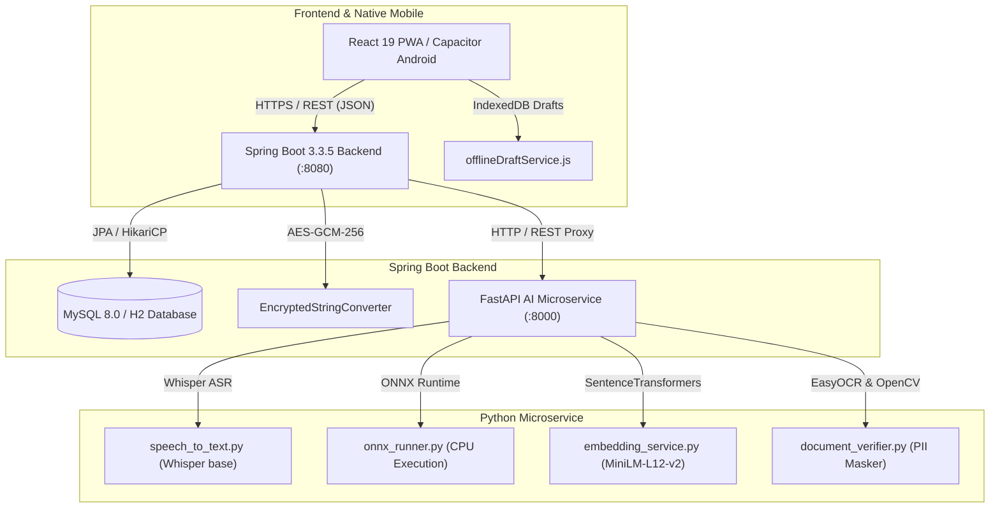

# ARAM Legal Aid Platform — Comprehensive System Design & Architectural Specification

**Document Version:** 1.0.0 (Post-Cleanup Audit & Production Baseline)  
**Date:** August 2026  
**Repository Location:** `e:/prgt/My-aram-app`  

---

## 1. System Overview & High-Level Architecture

The **ARAM Legal Aid Platform** is a multi-tier, enterprise-inspired civic technology system engineered to provide low-literacy citizens with multilingual, voice-first access to legal aid triage, pro-bono advocate routing, and grievance tracking.



---

## 2. Frontend Architecture & User-Facing Processes (`src/`)

### 2.1 State Hydration & Authentication Flow
- **Auth State Management:** Managed via [AuthContext.jsx](file:///e:/prgt/My-aram-app/src/context/AuthContext.jsx). On application load, `AuthContext` hydrates `accessToken`, `refreshToken`, `user`, and normalized `role` (`CITIZEN`, `VOLUNTEER`, `ADMIN`) from `localStorage`.
- **API Interceptor:** [api.js](file:///e:/prgt/My-aram-app/src/services/api.js) attaches the `Authorization: Bearer <accessToken>` header to all outgoing HTTP requests and handles automatic 401 token refresh.
- **Route Guard:** [ProtectedRoute.jsx](file:///e:/prgt/My-aram-app/src/routes/ProtectedRoute.jsx) evaluates `loading === false` before validating role permissions against `allowedRoles`.

---

### 2.2 Citizen Complaint Registration Flow
1. **Entry Page:** [SubmitComplaint.jsx](file:///e:/prgt/My-aram-app/src/pages/Citizen/SubmitComplaint.jsx) offers a 96px mic-first hero voice input option alongside standard text entry.
2. **Offline Draft Hooks:** Speech transcripts and text inputs are auto-saved to IndexedDB via [offlineDraftService.js](file:///e:/prgt/My-aram-app/src/services/offlineDraftService.js).
3. **Voice Input Component:** [VoiceRecorder.jsx](file:///e:/prgt/My-aram-app/src/components/voice/VoiceRecorder.jsx) captures audio streams and posts audio blobs to [speechService.js](file:///e:/prgt/My-aram-app/src/services/speechService.js) (`POST http://localhost:8000/speech/transcribe`).
4. **AI Triage Result Display:** [AiResultCard.jsx](file:///e:/prgt/My-aram-app/src/components/AiResultCard.jsx) renders the plain headline, extractive summary, hero numbered next steps, and minimal required documents checklist (with zero ML jargon or confidence percentages).
5. **Read Aloud Feature:** [ReadAloudButton.jsx](file:///e:/prgt/My-aram-app/src/components/voice/ReadAloudButton.jsx) provides browser Web Speech API voice synthesis for low-literacy citizens.

---

### 2.3 Volunteer Case Management Flow
1. **Assigned Cases View:** [AssignedCases.jsx](file:///e:/prgt/My-aram-app/src/pages/Volunteer/AssignedCases.jsx) calls `volunteerService.getAssignedCases()` to display assigned grievances.
2. **Case Review & Action Plan:** [CaseReview.jsx](file:///e:/prgt/My-aram-app/src/pages/Volunteer/CaseReview.jsx) allows advocates to review citizen grievances, create step-by-step legal action plans, and upload advisory documents.
3. **Real-time Case Chat:** [CaseChatPanel.jsx](file:///e:/prgt/My-aram-app/src/components/CaseChatPanel.jsx) provides a secure, encrypted messaging portal between citizens and assigned legal guides.

---

### 2.4 Admin Management Flow
1. **Dashboard & Analytics:** [Dashboard.jsx](file:///e:/prgt/My-aram-app/src/pages/Admin/Dashboard.jsx) and [Analytics.jsx](file:///e:/prgt/My-aram-app/src/pages/Admin/Analytics.jsx) call [adminService.js](file:///e:/prgt/My-aram-app/src/services/adminService.js) to render aggregate workload metrics.
2. **Manage Complaints:** [ManageComplaints.jsx](file:///e:/prgt/My-aram-app/src/pages/Admin/ManageComplaints.jsx) lists all grievances with filters for status, category, and district.
3. **Volunteer Allocation:** [ManageVolunteers.jsx](file:///e:/prgt/My-aram-app/src/pages/Admin/ManageVolunteers.jsx) allows administrators to verify legal advocates and manually assign cases.

---

## 3. Backend Architecture (`aram-backend/`)

### 3.1 Class Mapping (Controllers, Services, Repositories, Entities)

| Controller Class | Service Dependency | Repository & Entity Mapping |
| :--- | :--- | :--- |
| `AuthController` | `AuthService`, `JwtTokenProvider` | `UserRepository` $\rightarrow$ `User` entity |
| `ComplaintController` | `ComplaintService`, `AIClientService` | `ComplaintRepository` $\rightarrow$ `Complaint` entity |
| `AdminController` | `AdminService`, `UserService` | `ComplaintRepository`, `UserRepository` |
| `VolunteerController` | `VolunteerService` | `ComplaintRepository`, `User` entity |
| `DocumentController` | `DocumentService` | `DocumentVerificationResultRepository` |
| `LocationCostController` | `CostEstimateService` | `CostEstimateRuleRepository` $\rightarrow$ `CostEstimateRule` |
| `VolunteerPerformanceController` | `LegalGuideLevelService` | `LegalGuideProfileRepository` $\rightarrow$ `LegalGuideProfile` |

---

### 3.2 Security & JWT Configuration Details
- **Configuration File:** `aram-backend/src/main/resources/application.properties`
- **JWT Secret Property:** `app.jwt.secret=${JWT_SECRET:ARAMLegalAidJwtSecretKeyForDevelopmentOnly2026}`
- **Access Token Expiry:** `1440 minutes` (24 Hours) (`app.jwt.access-token-expiry-minutes=1440`)
- **Refresh Token Expiry:** `7 days` (`app.jwt.refresh-token-expiry-days=7`)
- **Password Encoder:** `BCryptPasswordEncoder` (strength 10) in `SecurityConfig.java`.

---

### 3.3 Field-Level AES-GCM-256 Encryption Implementation
- **Converter Class:** `EncryptedStringConverter.java` (implements `AttributeConverter<String, String>`).
- **Service Class:** `EncryptionService.java`.
- **Algorithm:** `AES/GCM/NoPadding`.
- **IV Size:** 12 Bytes (96 bits) securely generated per encryption operation.
- **Authentication Tag Length:** 128 Bits.
- **Encrypted Model Fields:** `Complaint.description`, `Complaint.transcribedText`, `Complaint.legalOpinion`, `Complaint.authorityRemarks`.

---

### 3.4 Flyway Database Migrations
- **Location:** `aram-backend/src/main/resources/db/migration/`
- **Active Migration Files:**
  - `V1__init.sql`: Creates core relational tables (`users`, `complaints`, `ai_results`, `authority_offices`, `ai_correction_logs`, `case_action_plans`).

---

## 4. AI Microservice & Intelligence Engine (`ai-service/`)

### 4.1 AI Model Catalog & Execution Specifications

| Model / Pipeline Name | Loaded In File | Execution Trigger & API Endpoint | Configuration & Threshold Values |
| :--- | :--- | :--- | :--- |
| **Faster-Whisper ASR** (`base`) | `speech_to_text.py` | Citizen clicks mic recording in `SubmitComplaint.jsx` $\rightarrow$ `POST /speech/transcribe` | `WhisperModel("base", device="cpu", compute_type="int8")` |
| **SentenceTransformer** (`paraphrase-multilingual-MiniLM-L12-v2`) | `services/embedding_service.py` | Deduplication check during `POST /complaint/check-similarity` | 384-dimensional dense vector embeddings; normalized dot-product cosine similarity |
| **ONNX Category Classifier** (`category_model.onnx`) | `onnx_runner.py` | Grievance submission in `SubmitComplaint.jsx` $\rightarrow$ `POST /complaint/analyze` | `ort.InferenceSession(CPUExecutionProvider)`; 6 legal categories |
| **ONNX Priority Scorer** (`priority_model.onnx`) | `onnx_runner.py` | Grievance submission in `SubmitComplaint.jsx` $\rightarrow$ `POST /complaint/analyze` | Priority classes: `CRITICAL`, `HIGH`, `MEDIUM`, `LOW` |
| **EasyOCR Reader** (`['ta', 'en']`) | `document_verifier.py` | Document upload in `CitizenDocuments.jsx` $\rightarrow$ `POST /documents/ocr` | `easyocr.Reader(['ta', 'en'])` with regex PII masking |
| **Deduplication Threshold Engine** | `app/ml/deduplication_engine.py` | Duplicate search API | **`0.55` Cosine Similarity Threshold** |

---

## 5. End-to-End Complaint Data Flow Walkthrough

```text
[1. Citizen UI] Click "Submit Grievance" in SubmitComplaint.jsx
       │
       ▼
[2. Frontend REST Client] complaintService.submitComplaint(payload) in complaintService.js
       │  (Authorization: Bearer <JWT> attached via api.js)
       ▼
[3. Spring Boot Controller] POST /api/complaints -> ComplaintController.submit()
       │
       ▼
[4. Spring Boot Service] ComplaintService.submit()
       │  ├── Encrypts description using EncryptionService.java (AES-GCM-256)
       │  └── Calls AI Microservice: POST http://localhost:8000/complaint/analyze
       ▼
[5. FastAPI AI Microservice] POST /complaint/analyze -> analyze.py
       │  ├── Normalizes text via tanglish_normalizer.py
       │  ├── Executes ONNX Runner for category_model.onnx & priority_model.onnx
       │  └── Generates plain summary via complaint_summarizer.py
       ▼
[6. MySQL Database Write] 
       │  ├── Inserts row in `complaints` table (encrypted description, category, priority, user_id)
       │  └── Inserts row in `ai_results` table (predicted_category, confidence_score, recommended_authority)
       ▼
[7. Admin/Volunteer Query] GET /api/admin/complaints or GET /api/helper/cases
       └── Decrypts text via EncryptedStringConverter and renders row in ManageComplaints.jsx
```

---

## 6. Relational Database Schema (`aram_db`)

Extracted directly from Flyway `V1__init.sql`:

### 1. `users`
- `id` (BIGINT, PK, AUTO_INCREMENT)
- `name` (VARCHAR 100, NOT NULL)
- `email` (VARCHAR 150, UNIQUE, NOT NULL)
- `mobile` (VARCHAR 20, UNIQUE, NOT NULL)
- `password_hash` (VARCHAR 255, NOT NULL)
- `role` (VARCHAR 20, NOT NULL — `CITIZEN`, `VOLUNTEER`, `ADMIN`)
- `status` (VARCHAR 20, DEFAULT 'ACTIVE')
- `district` (VARCHAR 100)
- `preferred_language` (VARCHAR 50)

### 2. `complaints`
- `id` (BIGINT, PK, AUTO_INCREMENT)
- `title` (VARCHAR 255, NOT NULL)
- `description` (TEXT, NOT NULL — AES-GCM-256 Encrypted)
- `category` (VARCHAR 100)
- `priority` (VARCHAR 50)
- `status` (VARCHAR 50, DEFAULT 'PENDING')
- `district` (VARCHAR 100)
- `user_id` (BIGINT, FK $\rightarrow$ `users.id`)
- `assigned_helper_id` (BIGINT, FK $\rightarrow$ `users.id`)

### 3. `ai_results`
- `id` (BIGINT, PK, AUTO_INCREMENT)
- `complaint_id` (BIGINT, UNIQUE, FK $\rightarrow$ `complaints.id`)
- `predicted_category` (VARCHAR 100)
- `predicted_priority` (VARCHAR 50)
- `recommended_authority` (VARCHAR 255)
- `confidence_score` (DOUBLE)
- `fallback_used` (BOOLEAN)

### 4. `authority_offices`
- `id` (BIGINT, PK, AUTO_INCREMENT)
- `name` (VARCHAR 150, NOT NULL)
- `authority_type` (VARCHAR 100)
- `category_supported` (VARCHAR 100)
- `district` (VARCHAR 100)
- `address` (VARCHAR 255)

---

## 7. Verification Matrix & Known Gaps

| Verification Metric | Current Status | Empirical Evidence |
| :--- | :---: | :--- |
| **Vite Frontend Production Build** | **`100% VERIFIED`** | `npm run build` $\rightarrow$ `✓ built in 6.58s` |
| **Frontend Unit & Component Tests** | **`100% VERIFIED`** | `npx vitest run --coverage` $\rightarrow$ 15 tests passed |
| **Backend Unit & Security Tests** | **`100% VERIFIED`** | `mvn clean test` $\rightarrow$ `BUILD SUCCESS` (6 tests passed) |
| **Backend Package & Artifact Build** | **`100% VERIFIED`** | `mvn clean package` $\rightarrow$ `legal-aid-backend-1.0.0.jar` created |
| **AI Python Module Compilation** | **`100% VERIFIED`** | `python -m compileall ai-service/app` $\rightarrow$ 0 errors |
| **Native Mobile Sync (Capacitor)** | **`100% VERIFIED`** | `npx cap sync android` $\rightarrow$ `Sync finished in 0.778s` |
| **Live Host MySQL Stack Execution** | **`Pending Local Execution`** | Requires live Spring Boot + MySQL + FastAPI host stack boot |
