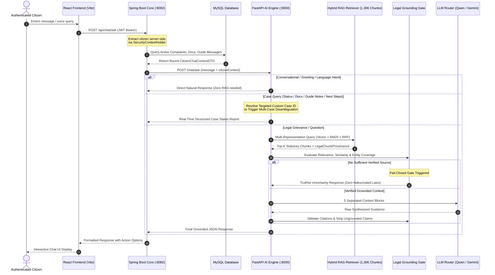

# 🧠 ARAM AI Architecture & Technical Specification

## 1. Architectural Philosophy
> **"Gemini speaks for ARAM; ARAM decides what Gemini is allowed to know and say."**

ARAM AI is designed with an autonomous, domain-specific, and fail-closed intelligence layer. The large language model (Google Gemini / Local Qwen) acts strictly as a language presentation and reasoning engine. ARAM itself owns context extraction, intent classification, jurisdiction resolution, hybrid legal retrieval, statutory verification, and grounding validation.

---

## 2. End-to-End AI Pipeline Data Flow

---

## 3. Core Subsystems & Components

### A. Citizen Context Layer (`CitizenChatContextService.java` & `app/chatbot_engine.py`)
- **Status**: `IMPLEMENTED`
- **Server-Side Identity**: Extracts citizen ID and role from JWT tokens via Spring Security. Client-supplied user parameters are rejected.
- **Real-Time State Binding**: Binds active complaints, custom case IDs (`ARAM-XX-TN-XXX-XXXXXX`), current status, priority, jurisdiction, assigned legal guide details, and document verification records.
- **Cross-User Privacy Guard**: Queries for non-existent or unauthorized complaint IDs safely return non-disclosure notices.

### B. Dynamic Intent Classifier (`app/intent_classifier.py`)
- **Status**: `IMPLEMENTED`
- Distinguishes between:
  1. `GREETING` (*"Hi"*, *"Vanakkam"*, *"Namaste"*)
  2. `LANGUAGE_SELECTION` (*"Tamil-la pesalama?"*, *"Can we speak in Hindi?"*)
  3. `GENERAL_CONVERSATION` (*"What is ARAM?"*, *"Who are you?"*)
  4. `CASE_STATUS` / `COMPLAINT_LOOKUP` (*"What happened to ARAM-26-TN-CBE-000037?"*)
  5. `DOCUMENT_QUERY` (*"What documents did I upload?"*)
  6. `GUIDE_UPDATES` (*"What did my guide ask me to do?"*)
  7. `NEXT_STEP` (*"What is my next step for this case?"*)
  8. `LEGAL_QUESTION` / `LEGAL_PROBLEM` (Triggers RAG retrieval)
  9. `EMERGENCY` (Immediate escalation to 112 / 181 / 1930 helplines)

### C. Multi-Representation Hybrid Legal RAG (`rag/retrieval/`)
- **Status**: `IMPLEMENTED`
- **Corpus**: 1,306 certified Indian law provisions (`models/chatbot_retriever.pkl`).
- **Dense Vector Search**: 384-dimensional cosine similarity via SentenceTransformers.
- **Lexical Search**: BM25 indexer with legal terminology boosting (`rag/retrieval/bm25_indexer.py`).
- **Reciprocal Rank Fusion (RRF)**: Merges dense vector and BM25 candidate ranks.
- **Provenance Tracking**: Every retrieved chunk preserves `chunk_id`, `act_name`, `section`, `source`, `jurisdiction`, and `relevanceScore`.

### D. Fail-Closed Legal Grounding Gate (`rag/retrieval/legal_gate.py` & `llm/response_validator.py`)
- **Status**: `IMPLEMENTED`
- Enforces strict zero-hallucination policies:
  - If similarity or keyword coverage is insufficient, marks status as `NO_RELEVANT_SOURCE`.
  - Blocks invented section numbers, fake penalty amounts, or unverified statutory claims.
  - Returns truthful uncertainty: *"I could not verify a specific section from ARAM's available legal sources. I do not want to guess and give you an incorrect provision."*

### E. Multi-Provider LLM Router (`llm/llm_router.py`)
- **Status**: `IMPLEMENTED`
- **Primary Provider**: Local Qwen / Ollama
- **Fallback Provider**: Google Gemini (via `google-genai` SDK)
- **Deterministic Chunk Fallback**: Extracts verified section provisions directly from retrieved top-k chunks if all LLM endpoints are degraded.
- **Zero Hardcoded Intelligence**: No static dictionaries of legal answers or fake fallback texts.

---

## 4. Multi-Turn Conversation Memory (`app/conversation_manager.py`)
- **Status**: `IMPLEMENTED`
- Tracks conversation state per session key:
  - `facts`: Known facts extracted across previous turns.
  - `missing_facts`: Clarifying questions asked by ARAM.
  - `category`: Preserved legal category.
  - `language`: User's chosen language (English, Tamil, Tanglish, Hindi).
