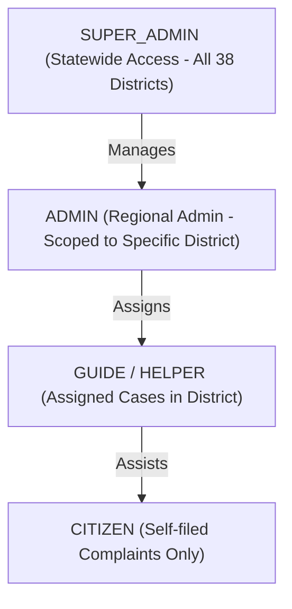

# ARAM AI — Authentication & Security Workflow

**Auth Microservice**: Port 8081 (`com.auth.*`)  
**Security Standard**: Stateless JWT (HS256) + BCrypt (Strength 12) + Refresh Token Rotation  

---

## 1. Token Lifecycles & Security Constraints

- **Access Token TTL**: 24 Hours (86,400,000 ms).
- **Refresh Token**: Stored in MySQL `refresh_tokens` table with UUIDv4 token values.
- **Password Reset**: 6-digit numeric OTP with 5-minute TTL dispatched via Google SMTP (`ouraramsupport@gmail.com`).

---

## 2. Canonical Roles & Permissions Matrix

| Canonical Role | Allowed Endpoints / Routes | Data Scoping Rule |
| :--- | :--- | :--- |
| **`ROLE_CITIZEN`** | `/api/complaints/my`, `/api/complaints` | `citizen_id == current_user.id` |
| **`ROLE_GUIDE`** | `/api/helper/cases`, `/api/helper/dashboard` | `assigned_helper_id == current_user.id` |
| **`ROLE_ADMIN`** | `/api/regional-admin/dashboard` | Filtered strictly by assigned `district` |
| **`ROLE_SUPER_ADMIN`**| `/api/admin/users`, `/api/admin/complaints` | Global access across all 38 districts |
