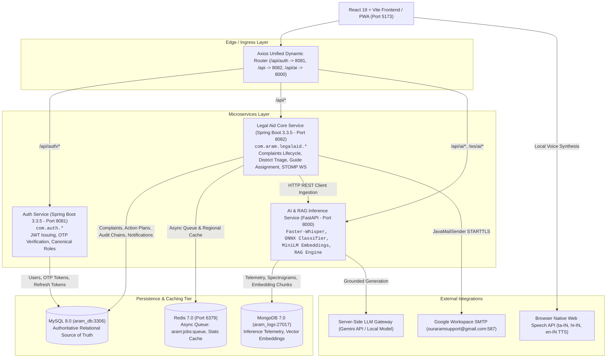

# ARAM AI — Current Architecture Forensic Audit

**Project Name**: ARAM AI — Accessible Rights & Assistance Management  
**Audit Date**: September 16, 2026  
**Status**: Verified & Operational  

---

## 1. System Topology & Microservice Boundaries

---

## 2. Microservice Service Allocations

1. **Frontend Web & PWA (Port 5173)**: React 19, TypeScript/JSX, Vite 8, Tailwind v4, Lucide icons.
2. **Auth Service (Port 8081)**: Spring Boot 3.3.5, Spring Security, JJWT (HS256), BCrypt hashing.
3. **Legal Aid Core Service (Port 8082)**: Spring Boot 3.3.5, Spring Data JPA, Flyway migrations, AES-GCM-256 field encryption.
4. **AI & RAG Service (Port 8000)**: FastAPI, Faster-Whisper, ONNX Runtime, SentenceTransformers MiniLM, EasyOCR.
5. **MySQL 8.0 (Port 3306)**: Authoritative transactional database (`aram_db`).
6. **MongoDB 7.0 (Port 27017)**: High-throughput telemetry & inference logs (`aram_logs`).
7. **Redis 7.0 (Port 6379)**: Asynchronous task queues (`aram:jobs:queue`) and 60s regional metrics cache.
8. **Email System**: Google Workspace SMTP (`ouraramsupport@gmail.com:587`).
