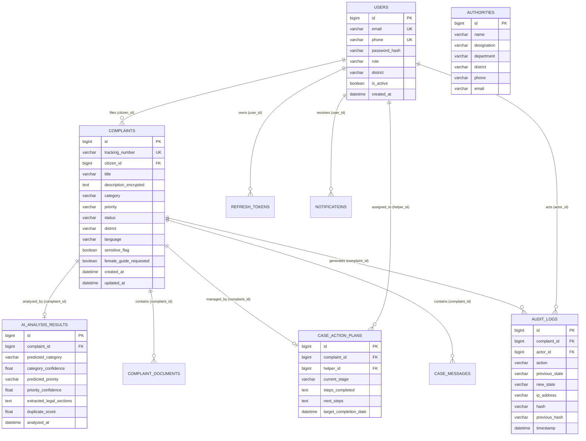

# ARAM — Database Schema & Data Architecture

**Database Systems**: MySQL 8.0 (`aram_db`), MongoDB 7.0 (`aram_logs`), Redis 7.0  
**Migration Framework**: Flyway (`V1__init.sql` through `V11__add_missing_relationship_foreign_keys.sql`)  

---

## 1. MySQL Relational Schema (`aram_db`)

---

## 2. Foreign Key Constraints & Cascade Policies

| Source Column | Target Column | On Delete Action | On Update Action | Integrity Purpose |
| :--- | :--- | :--- | :--- | :--- |
| `complaints.citizen_id` | `users.id` | `RESTRICT` | `CASCADE` | Prevents deleting citizens with active complaints |
| `case_action_plans.complaint_id` | `complaints.id` | `CASCADE` | `CASCADE` | Action plans lifecycle bound to complaint |
| `case_action_plans.helper_id` | `users.id` | `SET NULL` | `CASCADE` | Preserves action plan if guide account is deactivated |
| `ai_analysis_results.complaint_id` | `complaints.id`| `CASCADE` | `CASCADE` | Clean cascade of AI inference records |
| `audit_logs.complaint_id` | `complaints.id` | `SET NULL` | `CASCADE` | Preserves audit chain even upon record purge |
| `audit_logs.actor_id` | `users.id` | `RESTRICT` | `CASCADE` | Ensures immutable attribution of audit events |

---

## 3. MongoDB Collections (`aram_logs`)

1. **`ai_inference_telemetry`**: Stores full request/response payloads, inference latency, Faster-Whisper durations, and ONNX probability vectors.
2. **`vector_embeddings_store`**: Stores 384-dimensional `all-MiniLM-L12-v2` dense vectors for deduplication and RAG search.
3. **`document_ocr_logs`**: Stores bounding boxes, raw text extractions, and PII masking audit records.
4. **`chatbot_logs`**: Conversation session history, intent detection scores, and citation mappings.

---

## 4. Redis Keys & Cache Eviction Strategy

- **Queue (`aram:jobs:queue`)**: Redis list for heavy async task distribution (multi-page OCR, PDF export).
- **Regional Stats (`aram:cache:district:stats:{district}`)**: 60s TTL string cache for regional admin KPI cards.
- **Statewide Stats (`aram:cache:superadmin:statewide`)**: 30s TTL cache aggregating all 38 Tamil Nadu districts.
