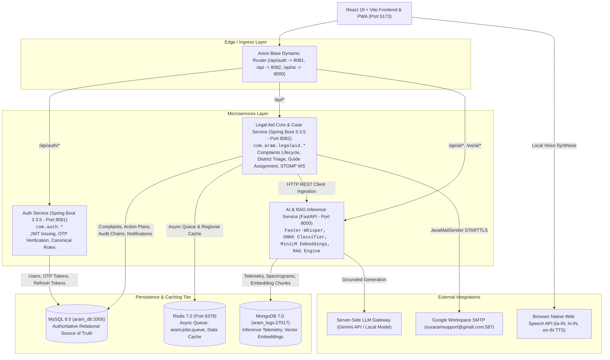

# ARAM — Final Target Architecture Specification

**Platform**: ARAM — Accessible Rights & Assistance Management  
**Status**: Target Architecture Baseline  
**Version**: 2.0-PROD  

---

## 1. Architectural Blueprint & Component Topology

---

## 2. Service Responsibilities & Domain Boundaries

### 1. `auth-service` (Port 8081)
- User identity lifecycle: Registration, Login, Token Refresh rotation.
- Password reset using 6-digit numeric OTP with 5-minute TTL.
- Role normalization: Canonical `CITIZEN`, `GUIDE`, `ADMIN`, `SUPER_ADMIN`.
- Issues HMAC-SHA256 Bearer JWT tokens containing `userId`, `email`, `role`, `district`.

### 2. `core-service` / `aram-backend` (Port 8082)
- Complaint domain lifecycle: `SUBMITTED` $\rightarrow$ `AI_ANALYZED` $\rightarrow$ `GUIDE_ASSIGNED` $\rightarrow$ `IN_PROGRESS` $\rightarrow$ `RESOLVED`.
- Strict district isolation: Regional Admin assigned to `Chennai` cannot access `Coimbatore` complaints.
- Legal authorities directory (TNSLSA, DLSA, TLSC, Police nodal officers).
- Guide case action plans, milestone checkoffs, and in-app chat.
- Audit logging with cryptographic tamper-evident hash chaining.
- Real-time event broadcasting via STOMP WebSocket (`/ws/updates`).

### 3. `ai-service` (Port 8000)
- Multilingual Speech-to-Text: `Faster-Whisper` (base INT8 CPU) for Tamil, English, and Hindi.
- Legal classification: 6-category ONNX classifier (`PROPERTY_DISPUTE`, `CONSUMER_COMPLAINT`, `LABOUR_WAGE`, `DOMESTIC_VIOLENCE`, `CYBERCRIME`, `GENERAL_CIVIC`).
- RAG Knowledge Base: `SentenceTransformers` (`MiniLM-L12-v2`) dense vector retrieval against Indian statutes and TN revenue rules.
- Document OCR & Redaction: `EasyOCR` with 12-digit Aadhaar and 10-char PAN regex masking.
- Explainable Guide Matcher: Computes weighted score based on district, language, specialization, and workload.

---

## 3. Database Architecture & Strategy

- **MySQL 8.0 (`aram_db`)**: Authoritative transactional database. Managed via Flyway migrations (`V1` to `V11`).
- **MongoDB 7.0 (`aram_logs`)**: AI telemetry logs, vector embedding metadata, and OCR traces.
- **Redis 7.0 (`Port 6379`)**: Asynchronous task queues (`aram:jobs:queue`) and 60-second district stats cache.
