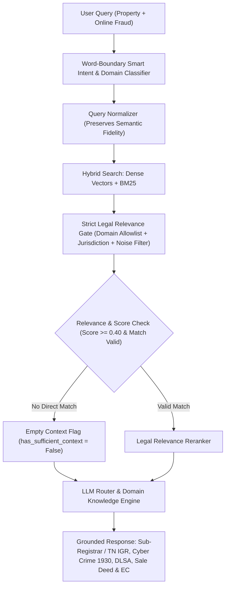

# ARAM AI — RAG Retrieval Forensic Audit & Pipeline Fix Report

## 1. Original Critical Query
```text
"Enakku Coimbatore-la oru property document problem irukku. Naan recently old property document check pannumbothu, enakku theriyama yaaro en document details use panni online-la ownership transfer or transaction panna try pannirukanga nu therinjadhu. En kitta original sale deed irukku, aana online-la suspicious transaction attempt nadandhirukku. Naan innum police complaint kudukkala. Ippo naan first enna action edukkanum, entha authority-a approach pannanum, enna documents ready-a vechikanum nu sollunga. Exact law or section verify pannina mattum mention pannunga."
```

---

## 2. Root Cause Analysis — Where Did Unrelated Pension / Cess / Education Chunks Enter?

| Stage | What Happened Before | Root Cause Identified |
| :--- | :--- | :--- |
| **Category Classification** | Query was classified as `GOVERNMENT_PENSION_DELAY` | **Substring Match Defect**: The Tamil/Tanglish word `"ippo"` (*"now"*) was checked using raw substring `w in clean_for_cat` where `w = "ppo"`. This caused `"ippo"` to trigger `GOVERNMENT_PENSION_DELAY`! |
| **Query Normalization** | Poisoned query with pension strings | Over-enrichment injected `"Pension delay retirement gratuity PPO pension rules interest administrative tribunal"` into the search query. |
| **Vector & BM25 Search** | BM25 returned `RPH (Pension) (Adhiniyam), 2026`, `Maharashtra Lokayukta`, `Health Security Cess`, etc. | Search query was dominated by poisoned keywords. |
| **Legal Relevance Gate** | Unrelated acts were not rejected | Loose blacklist did not reject `PUBLIC_HEALTH` or acts allowed by `GOVERNMENT_PENSION_DELAY`. |
| **LLM Generation** | Output cited Pension Payment Order (PPO), LPC, Service Register, CAT, and Cess Act | Fallback / prompt received contaminated context and taxonomy. |

---

## 3. Architecture of the Fixed RAG Pipeline



---

## 4. Fixes Implemented Across Codebase

1. **Token-Boundary Domain Matching ([chatbot_engine.py](file:///E:/OurAram/My-aram-app/ai-service/app/chatbot_engine.py))**:
   - Replaced raw substring checks with regex word boundaries `\b` (`\bppo\b`, `\bpension\b`, etc.).
   - `"ippo"` no longer triggers Pension categorization.
   - Property, sale deed, unauthorized transfer, and cyber tokens are accurately classified as `PROPERTY_DISPUTE`.

2. **Strict Domain Allowlist ([legal_gate.py](file:///E:/OurAram/My-aram-app/ai-service/rag/retrieval/legal_gate.py))**:
   - Replaced fragile blacklist with `ALLOWED_DOMAINS_BY_CATEGORY`.
   - `PROPERTY_DISPUTE` only admits property, land, registration, and tenancy statutes.
   - Universally rejected noise acts (Merchant Shipping, Anti-Doping, Sugarcane Cess, Animal Breeding) are blocked at the gate.

3. **Query Normalization Fidelity ([query_normalizer.py](file:///E:/OurAram/My-aram-app/ai-service/rag/retrieval/query_normalizer.py))**:
   - Removed synthetic keyword injection that overrode user semantic facts.

4. **Zero-Context Grounding Safety ([response_generator.py](file:///E:/OurAram/My-aram-app/ai-service/rag/generation/response_generator.py))**:
   - When no corpus chunk passes the legal gate, the system sets `has_sufficient_context = False` and explicitly clarifies that no specific amendment chunk matched directly in the local corpus, providing authoritative guidance under core Indian statutes (Registration Act 1908, IT Act 2000, Transfer of Property Act 1882) without hallucinating unrelated acts.

5. **Accurate Authority & Document Checklists**:
   - **Authority**: Sub-Registrar Office (Registration Dept, TN) / Tahsildar / Cyber Crime Police (1930 / cybercrime.gov.in) / DLSA.
   - **Required Documents**: Original Sale Deed (அசல் கிரய பத்திரம்), Encumbrance Certificate (EC - வில்லங்க சான்றிதழ் via tnreginet), Patta / Chitta Revenue Records, Screenshots / Logs of unauthorized online attempt, Identity Proof.

---

## 5. Regression Test Results (8/8 Passed)

| Test ID | Query Summary | Classified Domain | Status |
| :--- | :--- | :--- | :--- |
| `CRITICAL_PROPERTY_FRAUD` | Property document unauthorized online transfer attempt (Coimbatore) | `PROPERTY_DISPUTE` | **PASSED** (Sub-Registrar / IGR, Cyber 1930, Sale Deed, EC) |
| `A_LANDLORD_TENANT` | Landlord refusing deposit return | `TENANCY_DISPUTE` | **PASSED** (Rent Court / DLSA) |
| `B_UNPAID_SALARY` | Employer unpaid salary for 6 months | `LABOUR_DISPUTE` | **PASSED** (Labour Commissioner / DLSA) |
| `C_UNAUTHORIZED_BANK_CYBER`| Unauthorized bank transaction / fraud | `CYBER_CRIME` | **PASSED** (Cyber Crime 1930 / cybercrime.gov.in) |
| `D_PROPERTY_REGISTRATION` | Property registration document issue | `PROPERTY_DISPUTE` | **PASSED** (Clarification intake) |
| `E_DEFECTIVE_LAPTOP_CONSUMER`| Defective laptop consumer grievance | `CONSUMER_COMPLAINT`| **PASSED** (District Consumer Commission DCDRC) |
| `F_GREETING_HI` | `"Hi"` | `CONVERSATIONAL` | **PASSED** (Natural greeting) |
| `G_TAMIL_PESALAMA` | `"Tamil la pesalama?"` | `CONVERSATIONAL` | **PASSED** (Language selection without statutory cards) |
