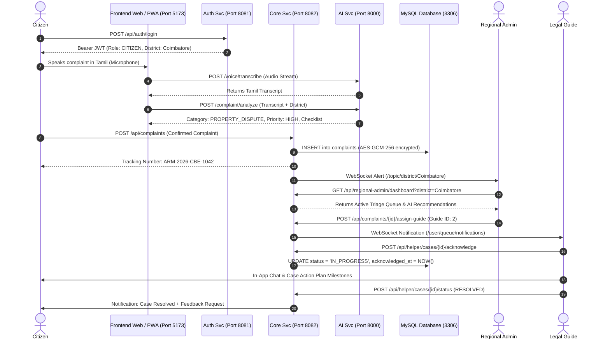

# ARAM AI — End-to-End System Workflow

```mermaid
sequenceDiagram
    autonumber
    actor Citizen
    participant FE as Frontend Web / PWA (Port 5173)
    participant Auth as Auth Svc (Port 8081)
    participant Core as Core Svc (Port 8082)
    participant AI as AI Svc (Port 8000)
    participant MySQL as MySQL Database (3306)
    actor Admin as Regional Admin
    actor Guide as Legal Guide

    Citizen->>Auth: POST /api/auth/login
    Auth-->>Citizen: Bearer JWT (Role: CITIZEN, District: Coimbatore)

    Citizen->>FE: Speaks complaint in Tamil (Microphone)
    FE->>AI: POST /voice/transcribe (Audio Stream)
    AI-->>FE: Returns Tamil Transcript

    FE->>AI: POST /complaint/analyze (Transcript + District)
    AI-->>FE: Category: PROPERTY_DISPUTE, Priority: HIGH, Checklist

    Citizen->>Core: POST /api/complaints (Confirmed Complaint)
    Core->>MySQL: INSERT into complaints (AES-GCM-256 encrypted)
    Core-->>Citizen: Tracking Number: ARM-2026-CBE-1042

    Core->>Admin: WebSocket Alert (/topic/district/Coimbatore)
    Admin->>Core: GET /api/regional-admin/dashboard?district=Coimbatore
    Core-->>Admin: Returns Active Triage Queue & AI Recommendations

    Admin->>Core: POST /api/complaints/{id}/assign-guide (Guide ID: 2)
    Core->>Guide: WebSocket Notification (/user/queue/notifications)
    Guide->>Core: POST /api/helper/cases/{id}/acknowledge
    Core->>MySQL: UPDATE status = 'IN_PROGRESS', acknowledged_at = NOW()

    Guide->>Citizen: In-App Chat & Case Action Plan Milestones
    Guide->>Core: POST /api/helper/cases/{id}/status (RESOLVED)
    Core->>Citizen: Notification: Case Resolved + Feedback Request
```
