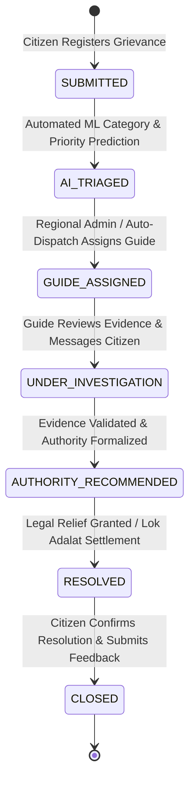

# 🔄 ARAM System & Operational Workflows

## 1. End-to-End Citizen Grievance Lifecycle

---

## 2. Core Workflow Details

### Stage 1: Citizen Registration & JWT Authentication
- **Status**: `IMPLEMENTED`
- Citizen registers with Name, Email, Password, District, and Mobile Number.
- Spring Security issues signed JWT tokens (1440 min expiry) containing user ID and role (`ROLE_CITIZEN`).

### Stage 2: Grievance Submission & Evidence Upload
- **Status**: `IMPLEMENTED`
- Citizen submits grievance title, description, district, and incident date.
- Sequential Case ID generated: `ARAM-{YY}-TN-{DISTRICT_CODE}-{SEQUENTIAL_NUMBER}` (e.g., `ARAM-26-TN-CBE-000037`).
- Automated OCR Readiness Verification (`/api/ai/verify-document`) checks uploaded evidence files.

### Stage 3: Automated AI Triage & Authority Recommendation
- **Status**: `IMPLEMENTED`
- FastAPI analyzes description to predict Category (`PROPERTY_DISPUTE`, `LABOUR_DISPUTE`, `CONSUMER_COMPLAINT`, `WOMEN_SAFETY`, `CYBER_CRIME`) and Priority (`LOW`, `MEDIUM`, `HIGH`, `CRITICAL`).
- Recommends competent redressal authority (District Legal Services Authority, Labour Commissioner, Sub-Registrar Office, National Cybercrime Helpline 1930).

### Stage 4: Statewide 38-District Administration & Oversight
- **Status**: `IMPLEMENTED`
- **Super Administrator**: Statewide command center monitoring active caseloads across all 38 Tamil Nadu districts.
- **District Grievance Redressal Officers**: District-scoped triage queue reviewing complaints and assigning specialized legal guides.

### Stage 5: Legal Guide Interaction & Real-Time Chat
- **Status**: `IMPLEMENTED`
- Assigned Legal Guide inspects complaint dossier, verifies document evidence, and issues instructions.
- Real-time WebSockets (`/ws/updates`) power interactive citizen-to-guide messaging.

### Stage 6: Resolution & Citizen Feedback
- **Status**: `IMPLEMENTED`
- Guide submits final resolution report and updates case status to `RESOLVED`.
- Citizen reviews resolution summary and submits service quality rating.
