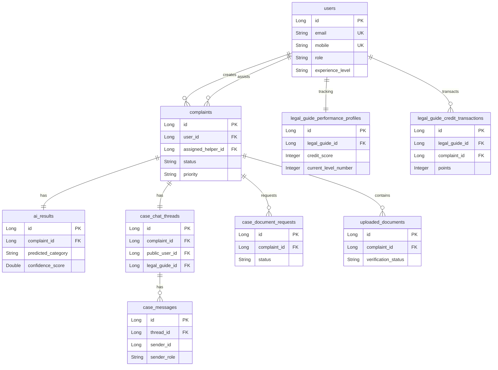

# ARAM V2 — Complete Project Context Audit

This document contains a full audit of the current ARAM Legal Aid Platform code repositories, encompassing architecture, frontend systems, core backend services, FastAPI AI pipelines, database schemas, workflow journeys, and mock structures.

---

## A. Project Architecture

The ARAM Legal Aid Platform is implemented as a microservice system containing:
1. **Frontend Client**: React Single Page Application (SPA) built using Vite. Serves Citizen, Guide (Volunteer), and Admin dashboards.
2. **Core Backend Service**: Spring Boot Java service responsible for persistence, validation, workflow transitions, document storage, and notification distribution.
3. **AI Service**: FastAPI Python microservice running predictions for complaint classifications, script language identification, OCR validation, speech-to-text, and matching rankings.

### System Connectivity Grid
```
[ Citizen/Admin/Guide Browser ]
        │            │
        │ HTTP REST  │ HTTP REST (AI Proxy / Speech Input)
        ▼            ▼
[ Spring Boot Core (8082) ] ───HTTP/REST───► [ FastAPI AI Service (8000) ]
        │                                             │
        ▼ JPA                                         ▼ MongoDB (optional)
[ MySQL Database (3306) ]                     [ AI Action Logs ]
```

---

## B. Frontend Structure

### Code Map
- **Config & Main Entry**: [App.jsx](file:///e:/OurAram/My-aram-app/src/App.jsx), [main.jsx](file:///e:/OurAram/My-aram-app/src/main.jsx)
- **Role Enforcement & Authentication**: [ProtectedRoute.jsx](file:///e:/OurAram/My-aram-app/src/routes/ProtectedRoute.jsx), [AuthContext.jsx](file:///e:/OurAram/My-aram-app/src/context/AuthContext.jsx)
- **Services (API communication)**: [api.js](file:///e:/OurAram/My-aram-app/src/services/api.js), [complaintService.js](file:///e:/OurAram/My-aram-app/src/services/complaintService.js), [volunteerService.js](file:///e:/OurAram/My-aram-app/src/services/volunteerService.js), [adminService.js](file:///e:/OurAram/My-aram-app/src/services/adminService.js)
- **Shared Components**: [VoiceRecorder.jsx](file:///e:/OurAram/My-aram-app/src/components/voice/VoiceRecorder.jsx), [ReadAloudButton.jsx](file:///e:/OurAram/My-aram-app/src/components/voice/ReadAloudButton.jsx)

### Pages Distribution
* **Citizen Workspace** (`src/pages/Citizen/`):
  - `Dashboard.jsx`: Overall triage summary, active complaints table, and quick actions launcher.
  - `SubmitComplaint.jsx`: Form supporting standard text entry or voice dictation with language options.
  - `AIAnalysis.jsx`: Visual view of the ML triage output (predicted category, priority level, matching required documents, and recommended authority).
  - `ComplaintHistory.jsx`: Historical list of submitted complaints.
  - `ComplaintDetails.jsx`: Detailed case log, legal opinion viewer, evidence uploader, and action plan reader.
  - `Chatbot.jsx`: Multilingual helper chatbot conversation.
  - `MessagesInbox.jsx`: Direct support channel to the assigned legal guide.
  - `HelpCenter.jsx`: Interactive legal FAQ module with voice narration support.

* **Volunteer/Guide Workspace** (`src/pages/Volunteer/`):
  - `Dashboard.jsx`: Assigned workload statistics, incoming notifications queue, availability toggle.
  - `AssignedCases.jsx`: Grid filtering current active and resolved cases.
  - `ComplaintDetails.jsx`: Guide view of complaint, legal details, history, and actions.
  - `CaseReview.jsx`: Workspace to draft Action Plans, request documents, and update status.
  - `MyAnalytics.jsx`: Dashboard showing performance metrics, credit trends, and level badges.

* **Admin Workspace** (`src/pages/Admin/`):
  - `Dashboard.jsx`: Operational indicators, pending guide requests queue, global platform logs.
  - `ManageUsers.jsx`: Account administration console.
  - `ManageComplaints.jsx`: Master complaint queue with review and update features.
  - `ComplaintDetails.jsx`: Triage oversight with similar complaint matching and guide recommendation algorithms.
  - `ManageVolunteers.jsx`: Guide validation portal to approve/reject helpers.
  - `VolunteerAnalytics.jsx` & `VolunteerActivityOverview.jsx`: Performance audits, manual level modifications, and credit awards.

---

## C. Core Service

### Backend Configuration
- **Main Property File**: [application.properties](file:///e:/OurAram/My-aram-app/aram-backend/src/main/resources/application.properties)
- **MySQL Profile**: [application-mysql.properties](file:///e:/OurAram/My-aram-app/aram-backend/src/main/resources/application-mysql.properties)
- **Active Port**: `8082` (configured at `server.port`)
- **FastAPI Destination**: `http://localhost:8000` (configured at `ai.service.url`)
- **JWT Key Fallback**: `ARAMLegalAidJwtSecretKeyForDevelopmentOnly2026` (`app.jwt.secret`)
- **Upload Target**: `uploads/` (`app.upload.dir`) with max limits of 10MB (`app.upload.max-size-mb`) and multi-part servlet parameters of 25MB.

---

## D. AI Service

- **Main Entrypoint**: [main.py](file:///e:/OurAram/My-aram-app/ai-service/app/main.py)
- **Routing Module**: [analyze.py](file:///e:/OurAram/My-aram-app/ai-service/app/routers/analyze.py)
- **Port**: `8000`
- **Fallback Mocks**: Uses python system module injection in `main.py` to bypass importing physical ML packages (`sentence_transformers`, `faster_whisper`, `easyocr`, `cv2`, `sklearn`) if they are absent, providing fallback response formats.

---

## E. Database

Schema is managed via Flyway migration [V1__init.sql](file:///e:/OurAram/My-aram-app/aram-backend/src/main/resources/db/migration/V1__init.sql) and JPA Entity classes inside `com.aram.legalaid.model`.

### Entity Schematics


---

## F. Citizen Flow

```
[Login] ──► [Dashboard] ──► [Submit Complaint] ──► [AI Triage Response]
                                                          │
                                                          ▼
[Close Case] ◄── [Submit Feedback] ◄── [Verify Docs] ◄── [Upload Evidence]
```

1. **Login**: Authenticates via `src/pages/Auth/Login.jsx` calling `/api/auth/login`. Sets accessToken in localStorage.
2. **Submit Complaint**: Executed through `src/pages/Citizen/SubmitComplaint.jsx`. Connects voice inputs using `VoiceRecorder.jsx` or parses input directly via normal text.
3. **AI Analysis & Triage**: Submission calls `/api/complaints`. The backend makes a request to FastAPI `/complaint/analyze` to determine category, priority, necessary document lists, and target authorities. Results are stored in the `ai_results` table and displayed in `src/pages/Citizen/AIAnalysis.jsx`.
4. **Action Plans & Document Upload**: When the Guide is assigned and updates case steps, the citizen views these under `ComplaintDetails.jsx`. Additional evidence can be submitted using the document picker which invokes `/api/documents/upload` -> `ocrVerify()`.
5. **Close & Feedback**: Once resolved, the citizen reviews the results and closes the case, triggering `/api/feedback` to submit performance ratings and credit transactions.

---

## G. Admin Flow

1. **Dashboard & Queue**: Admin logs into `src/pages/Admin/Dashboard.jsx`. Reviews complaints queue under `/admin/manage-complaints`.
2. **Volunteer Recommendations**: In `AdminComplaintDetails.jsx`, the system fetches guide recommendations by calling `/api/admin/complaints/{id}/recommended-guides` which queries the FastAPI ranking endpoint `/recommend/volunteer`.
3. **Assignment Control**: Admin selects a volunteer. The backend endpoint `/api/admin/complaints/{id}/assign-legal-guide` checks user priority, workload capacity, and role constraints:
   - *Constraint*: Assigning a Junior Guide to a HIGH/CRITICAL priority case requires a detailed override reason of at least 10 characters.
   - *Constraint*: Assigning a guide to a sensitive case of preferred female category requires validation of training badges (`womenSupportTrained`) or explicit override reasons.

---

## H. Guide Flow

1. **Workload & Dashboard**: Guide logs into `src/pages/Volunteer/Dashboard.jsx` to view assigned complaints fetched from `/api/helper/cases`.
2. **Triage Steps**: From `CaseReview.jsx`, the guide can:
   - Add note logs via POST `/api/volunteer/cases/{id}/notes` (sets `legalOpinion` in complaint).
   - Create document requests via POST `/api/volunteer/cases/{id}/request-documents` (status changes to `DOCUMENTS_PENDING`).
   - Create/Share Action Plans via POST `/api/volunteer/cases/{id}/action-plan` and `/share-action-plan`.
   - Update statuses (e.g. `RESOLVED_BY_GUIDE`) using `/api/volunteer/cases/{id}/status`.

---

## I. AI Pipeline

Implemented in the `ai-service` directory.
- **Language Detection**: `ml_language_detector.py` checks native script boundaries (Tamil: `0x0B80–0x0BFF`, Devanagari: `0x0900–0x097F`).
- **Translation/Normalization**: `multilingual_normalizer.py` converts native phrases and transliterated romanized text (Tanglish/Hinglish key matching) to structured keywords.
- **Classifier Models**: Uses custom ONNX model runtimes (`category_model.py`, `priority_model.py`, `similar_complaint_model.py`) to determine categories, risk scores, and check for duplicates in the DB.
- **Volunteers Ranking**: `volunteer_ranking_model.py` scores volunteers based on specializations, language matching, workload, location, and sensitive case training.

---

## J. Voice Pipeline

1. **Capture**: Client mic records audio chunk data in `VoiceRecorder.jsx`.
2. **Real-time Recognition**: Utilizes Web Speech API for live transcription.
3. **Backend Fallback**: If Web Speech fails or lacks accuracy, the raw wav array is dispatched to `/api/speech/transcribe` -> FastAPI `/voice/transcribe`.
4. **Whisper Transcription**: FastAPI converts input to 16kHz mono via FFmpeg, running the faster-whisper `WhisperModel` to output text.

---

## K. Document/Evidence Pipeline

1. **Submission**: User uploads via `/api/documents/upload` (`DocumentController.java`).
2. **OCR Parsing**: Triggered via `ocrVerify()`. Sends file payload to FastAPI `/documents/verify` with target categories.
3. **Validation & States**: Extracts raw text using OCR, matching format layouts to determine verification flags:
   - `VERIFIED`, `REJECTED`, `REUPLOAD_REQUIRED`, `MANUAL_REVIEW_REQUIRED`.
4. **Access Control**: Checked on download/view inside `DocumentService.getSecureDocumentPath()` ensuring only owners, assigned guides, or admins can access document blobs (preventing IDOR attacks).

---

## L. Language Pipeline

The system is configured to support multilingual mapping:
- Tamil (Native script code block mapping or Tanglish transliterated keyword maps like *velai*, *prachanai*).
- Hindi (Devanagari script character boundaries or Hinglish transliterated words like *paisa*, *shikayat*).
- English (Fallback defaults).

---

## M. Guide Credit/Level System

Governed by [LegalGuideLevelService.java](file:///e:/OurAram/My-aram-app/aram-backend/src/main/java/com/aram/legalaid/service/LegalGuideLevelService.java) and `LegalGuidePerformanceProfile`.

### Threshold Rules
- **Level 1**: Beginner Legal Guide (0 - 99 score)
- **Level 2**: Active Legal Guide (100 - 249 score)
- **Level 3**: Trusted Legal Guide (250 - 499 score)
- **Level 4**: Senior Legal Guide (500 - 899 score)
- **Level 5**: Expert Legal Guide (900 - 1499 score)
- **Level 6**: Lead Legal Guide (1500+ score)

### Reward Ledger
- `CASE_RESOLVED_BY_GUIDE` (Guide resolves case): **+20 points**
- `USER_CONFIRMED_RESOLVED` (Citizen closes case): **+20 points**
- `DOCUMENT_REQUEST_CREATED` (Requests supporting docs): **+5 points**
- `DOCUMENT_VERIFIED` (Helper verifies document): **+5 points**
- `USER_FEEDBACK_5_STAR`: **+10 points**
- `USER_FEEDBACK_4_STAR`: **+7 points**

### Penalty Ledger
- `CASE_REOPENED_POOR_GUIDANCE` (Citizen reopens case): **-15 points** (sets `downgradeReviewRequired = true`)
- `PRIVACY_VIOLATION` (Privacy breach recorded): **-25 points** (sets `downgradeReviewRequired = true`)
- `LOW_USER_FEEDBACK_2_STAR`: **-10 points**
- `LOW_USER_FEEDBACK_1_STAR`: **-15 points**

### Level Transition Rules
- **Upgrade**: Handled automatically if credit score fits the new level, reopen rate is <25%, and there are no privacy violations.
- **Downgrade**: If points fall below the current level's threshold, it flags `downgradeReviewRequired = true` for Admin review. Admins must explicitly call `approveDowngrade()` to process the level change.

---

## N. Real-Time System

> [!IMPORTANT]
> **No WebSockets or Socket.io connection exists** in either the frontend or backend repositories. Real-time updates, chat messages, and status changes are handled via standard HTTP REST API endpoints.

---

## O. Messaging

- **Mapping**: Mapped to the `CaseMessage` entity. Messages are associated with a `CaseChatThread` using `complaintId`.
- **Security Check**: Enforced in `CaseCommunicationService.getChatMessages()`. Only the complaint owner, assigned guide, or admins can query messages or send chat replies.

---

## P. Notifications

- **Entity Model**: `Notification.java` database records.
- **Trigger Points**: Triggered by user assignment, document requests, status transitions, and appointment updates.
- **Toasts**: Handled via local browser page alerts using the `sonner` NPM library.

---

## Q. Security/Authorization

- **Stateless Verification**: JWT filters extract identity headers in `JwtFilter.java`.
- **Role Authority mapping**: Checks Spring Security credentials (`ROLE_CITIZEN`, `ROLE_HELPER`, `ROLE_ADMIN`).
- **IDOR Protection**:
  - Complaints: validated in `ComplaintService.java`.
  - Documents: validated in `DocumentService.getSecureDocumentPath()`.
  - Messages: validated in `CaseCommunicationService.java`.

---

## R. API Inventory

### Auth & User Endpoints
- `POST /api/auth/register` (Public) - Create user.
- `POST /api/auth/login` (Public) - Login, returns JWT + User.
- `POST /api/auth/forgot-password` (Public) - Initiates reset.
- `POST /api/auth/verify-reset-otp` (Public) - Checks OTP code.
- `POST /api/auth/reset-password` (Public) - Changes password.
- `GET /api/users/me` (Authenticated) - Get current user profile.
- `PUT /api/users/me` (Authenticated) - Update profile info.
- `POST /api/users/me/avatar` (Authenticated) - Upload avatar file.

### Citizen Endpoints
- `POST /api/complaints` (Role: CITIZEN) - Submit new complaint.
- `GET /api/complaints/my` (Role: CITIZEN) - Get logged-in citizen's complaints.
- `GET /api/complaints/{id}` (Role: CITIZEN/GUIDE/ADMIN) - Get complaint details.
- `GET /api/citizen/complaints/{id}/action-plan` (Role: CITIZEN) - View shared action plan.
- `GET /api/citizen/complaints/{id}/authority-locations` (Role: CITIZEN) - View nearby authority offices.
- `GET /api/citizen/complaints/{id}/cost-estimate` (Role: CITIZEN) - Get fee estimation.
- `POST /api/appointments` (Role: CITIZEN) - Request guide call/meeting.
- `GET /api/appointments/complaint/{id}` (Role: CITIZEN/GUIDE) - Get case appointments.
- `POST /api/feedback` (Role: CITIZEN) - Rate resolved case.

### Admin Endpoints
- `GET /api/admin/dashboard` (Role: ADMIN) - Overall stats.
- `GET /api/admin/complaints` (Role: ADMIN) - All complaints.
- `GET /api/admin/users` (Role: ADMIN) - List users.
- `DELETE /api/admin/users/{id}` (Role: ADMIN) - Delete user.
- `GET /api/admin/volunteers` (Role: ADMIN) - List guides.
- `PUT /api/admin/volunteers/{id}/verify` (Role: ADMIN) - Verify guide.
- `PUT /api/admin/volunteers/{id}/reject` (Role: ADMIN) - Reject guide.
- `POST /api/admin/complaints/{id}/assign-legal-guide` (Role: ADMIN) - Assign guide (with overrides checks).
- `GET /api/admin/volunteers/{id}/performance` (Role: ADMIN) - View performance profile.
- `POST /api/admin/volunteers/{id}/credits` (Role: ADMIN) - Award credits.
- `POST /api/admin/volunteers/{id}/deduct-credits` (Role: ADMIN) - Deduct credits.
- `POST /api/admin/volunteers/{id}/approve-downgrade` (Role: ADMIN) - Approve level downgrade.
- `POST /api/admin/volunteers/{id}/manual-level-change` (Role: ADMIN) - Force level change.
- `GET /api/admin/level-rules` (Role: ADMIN) - View level settings.

### Guide Endpoints
- `GET /api/helper/dashboard` (Role: HELPER) - Workload & stats.
- `GET /api/helper/cases` (Role: HELPER) - List assigned cases.
- `GET /api/helper/cases/{id}` (Role: HELPER) - Get assigned case details.
- `PUT /api/helper/availability` (Role: HELPER) - Toggle availability status.
- `PUT /api/helper/cases/{id}/status` (Role: HELPER) - Update case status.
- `POST /api/helper/cases/{id}/notes` (Role: HELPER) - Add legal note.
- `POST /api/volunteer/cases/{id}/notes` (Role: HELPER) - Add structured case note.
- `GET /api/volunteer/cases/{id}/action-plan` (Role: HELPER) - Get action plan.
- `POST /api/volunteer/cases/{id}/action-plan` (Role: HELPER) - Save action plan.
- `POST /api/volunteer/cases/{id}/share-action-plan` (Role: HELPER) - Share action plan with citizen.
- `POST /api/volunteer/cases/{id}/request-documents` (Role: HELPER) - Request specific document.
- `POST /api/volunteer/cases/{id}/escalate` (Role: HELPER) - Escalate case to Admin.
- `GET /api/volunteer/cases/{id}/cost-estimate` (Role: HELPER) - View cost estimate.
- `PUT /api/volunteer/cases/{id}/cost-estimate` (Role: HELPER) - Update cost estimate details.

### Message & Notification Endpoints
- `GET /api/cases/{complaintId}/messages` (Authenticated) - Get chat thread.
- `POST /api/cases/{complaintId}/messages` (Authenticated) - Post message.
- `PUT /api/cases/messages/{messageId}/read` (Authenticated) - Mark message as read.
- `GET /api/notifications` (Authenticated) - Get user notifications.
- `GET /api/notifications/unread-count` (Authenticated) - Unread count.
- `PUT /api/notifications/{id}/read` (Authenticated) - Mark notification read.

### Document & File Endpoints
- `POST /api/documents/upload` (Authenticated) - Upload evidence file.
- `POST /api/documents/ocrVerify` (Authenticated) - Run document OCR verify.
- `PUT /api/documents/verify/{documentId}` (Role: HELPER/ADMIN) - Manual override document status.
- `GET /api/documents/requests/complaint/{complaintId}` (Authenticated) - Get requested documents.
- `PUT /api/documents/requests/{requestId}/upload` (Role: CITIZEN) - Upload requested document.
- `PUT /api/documents/requests/{requestId}/verify` (Role: HELPER) - Verify requested document.
- `PUT /api/documents/requests/{requestId}/reject` (Role: HELPER) - Reject requested document.

### AI Service Endpoints
- `POST /complaint/analyze` - Analyzes complaint category/priority.
- `POST /chat/ask` - Question/Answer engine.
- `POST /documents/ocr` - Extract raw text.
- `POST /documents/verify` - Check if document matches template.
- `POST /recommend/volunteer` - Recommendation matching algorithm.
- `POST /voice/transcribe` - Whisper audio translation.

---

## S. Real Data vs Mock Data

### Frontend Mock Configurations
- **Mock Switch**: `VITE_USE_MOCKS` in [.env](file:///e:/OurAram/My-aram-app/.env). When set to `true`, the UI uses local storage seed arrays inside `src/data/mock/index.js` for users, complaints, and notifications, skipping Spring Boot backend requests entirely.

### AI Service Falling Modules
- FastAPI (`ai-service/app/main.py`) mocks ML modules if libraries are missing in the local Python environment, generating mock prediction formats for categories, OCR, Whisper transcripts, and translation results to prevent application startup crashes.

---

## T. Build/Test Status

- **Frontend Compilation**: **PASS** (Tested using `npm run build`).
- **Core Backend Tests**: **PASS** (6 unit tests completed successfully).
- **FastAPI Pytest**: **NOT AVAILABLE** (Test runner library not preinstalled in virtual environment).

---

## U. Current End-to-End Flow

### Complaint Submission and Resolution Pipeline
```
Citizen                 React Client              Spring Boot Backend          FastAPI AI
   │                         │                            │                        │
   │─── Submit Complaint ───►│                            │                        │
   │    (Voice/Text)         │─── POST /complaints ──────►│                        │
   │                         │                            │─── POST /analyze ─────►│
   │                         │                            │◄── Triage JSON ────────│
   │                         │◄── Return Triage Response ─│                        │
   │                         │                            │                        │
   │◄── Show AI Analysis ────│                            │                        │
   │                         │                            │                        │
   │                         │                            │                        │
   │                         │◄── Assigned Guide Msg ─────│                        │
   │                         │                            │                        │
   │─── Upload Document ────►│─── POST /docs/upload ─────►│                        │
   │                         │                            │─── POST /verify ──────►│
   │                         │                            │◄── Verify JSON ────────│
   │                         │◄── Doc Verification Msg ───│                        │
   │                         │                            │                        │
   │─── Confirm Close ──────►│─── PUT /complaints/status ─│                        │
   │    & Feedback           │    & POST /feedback        │─── +XP Points ─────────│
   │                         │◄── Resolution Success ─────│                        │
```

---

## V. Known Limitations

1. **No Real-Time Transport**: Communication uses REST request loops instead of active WebSocket connections.
2. **FastAPI ML Fallbacks**: Machine learning classifiers fall back to mock predictions if system libraries (ONNX/Whisper) are offline.
3. **Database Duality**: Development configurations run an in-memory H2 instance, resetting all data on restart unless run with the `-Dspring-boot.run.profiles=mysql` flag.

---

## W. Files That Would Need Modification for Future Changes

- **Adding Triage Rules/Workflow Steps**:
  - Core Backend: `com.aram.legalaid.service.CaseActionPlanService` and `com.aram.legalaid.service.AdditionalFlowsService`.
  - Frontend: `src/pages/Citizen/ComplaintDetails.jsx` and `src/pages/Volunteer/CaseReview.jsx`.
- **Modifying Guide XP / Levels Rules**:
  - Core Backend: `com.aram.legalaid.service.LegalGuideLevelService` and `com.aram.legalaid.model.LegalGuidePerformanceProfile`.
- **Updating AI Classifiers / Language Maps**:
  - AI Service: `ai-service/app/nlp/ml_language_detector.py` and `ai-service/app/nlp/multilingual_normalizer.py`.
